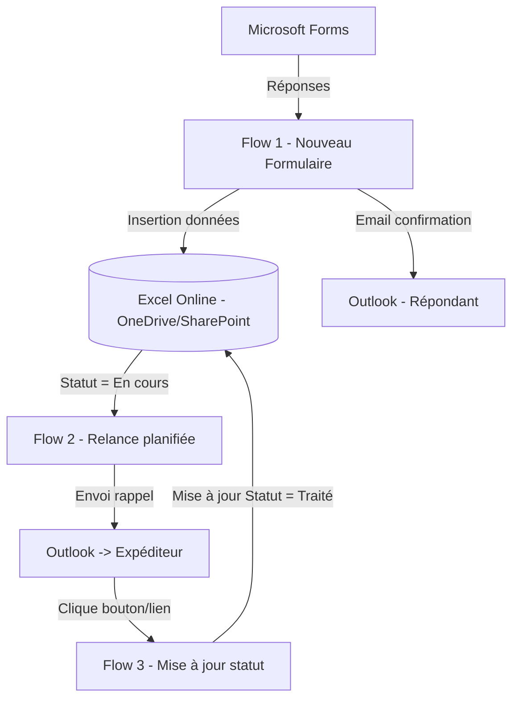

# 📊 Architecture du projet : Microsoft Forms + Excel + Power Automate

## 🔎 Objectif
Mettre en place un système de collecte de données, suivi et relance automatique **sans Supabase, SMTP externe, Python ou Next.js**, entièrement basé sur Microsoft 365.

- Collecte des réponses via **Microsoft Forms**.
- Stockage dans un **fichier Excel Online** (OneDrive/SharePoint).
- Relance automatique par email pour les demandes **en cours**.
- Suivi du statut : **En cours → Traité**.

---

## 🏗️ Schéma d’architecture

